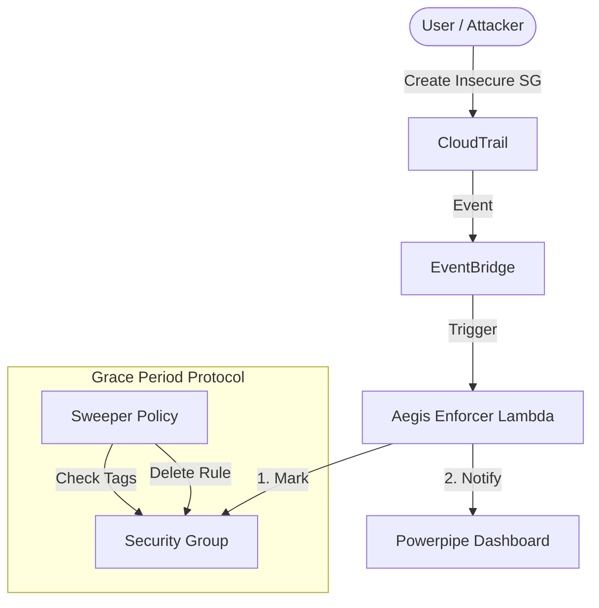

# 🛡️ Project Aegis: The Autonomous Cloud Immune System

> _"A governance engine that cleans up cost leakage and neutralizes security threats in real-time."_

**Project Aegis** is a multi-cloud governance platform (AWS & Azure) built with **Policy-as-Code**. Unlike traditional "audit" tools that just send emails, Aegis acts as an active immune system—automatically identifying orphaned resources ("zombies") and destroying security risks.

---

## 🏗️ Architecture

Aegis operates on an Event-Driven Architecture to ensure milliseconds-latency response to threats.



---

## 🚀 Key Capabilities

| Feature             | Function                                | Latency          | Protocol                |
| :------------------ | :-------------------------------------- | :--------------- | :---------------------- |
| **The Janitor** 🧹  | Identifies & deletes orphaned EBS/Disks | Daily            | **Cost Optimization**   |
| **The Enforcer** 🔫 | Detects & kills insecure Security Rules | **< 30 Seconds** | **Zero-Trust Security** |
| **Grace Period** ⏳ | Buffers deletion to allow admin review  | 5 Minutes        | **Mark-and-Sweep**      |
| **The Auditor** 📊  | Visualizes kills & savings in real-time | Live             | **Observability**       |

---

## 🧠 The "Brain": Policies

Aegis uses **Cloud Custodian** to define rules.

### 1. Security Enforcer (Mark-and-Sweep)

Instead of "shoot first, ask questions later," Aegis now uses a sophisticated **Grace Period** protocol.

| Phase            | Action               | Description                                                                       |
| :--------------- | :------------------- | :-------------------------------------------------------------------------------- |
| **1. Detection** | `mark-for-op`        | Instantly tags the resource: `custodian_cleanup: remove-permissions@<timestamp>`. |
| **2. Warning**   | **Dashboard**        | The resource appears in the **"Pending Kills"** table on the dashboard.           |
| **3. Execution** | `remove-permissions` | After **5 Minutes**, the Sweeper deletes the rule if it remains non-compliant.    |

### 2. Cost Janitor

- **Orphaned EBS Volumes**: Marked for deletion after 4 days of disuse.
- **Unattached IPs**: Released immediately to save costs.

---

## 📊 The Dashboard (Proof of Value)

The **Powerpipe Dashboard** provides a single pane of glass for the "Immune System".

### Key Views

1.  **Pending Kills** (Grace Period):
    - Shows resources currently on "Death Row".
    - Displays the countdown trigger time.
2.  **Recent Kills** (Audit Log):
    - Immutable log of every threat neutralized by the system.
    - Sourced directly from **CloudTrail**.

---

## 🛠️ Project Structure

```bash
aegis-governance/
├── config/              # Central configuration (e.g., S3 Bucket Policies)
├── dashboard/           # Powerpipe Dashboard code (*.pp)
├── policies/            # The "Brain" (YAML Policies)
│   ├── aws-cost-governance.yml
│   └── aws-security-enforcer.yml
├── tests/               # Test payloads (trigger.json)
└── .github/             # CI/CD Pipelines
```

## 🔧 Usage Guide

### prerequisites

- AWS CLI configured with Admin permissions.
- Python 3.10+ & Cloud Custodian (`pip install c7n`).
- Steampipe & Powerpipe (for the Dashboard).

### Deploying Policies

```bash
# Deploy to US-East-1
custodian run --output-dir . -r us-east-1 policies/aws-security-enforcer.yml
```

### Running the Dashboard

```bash
cd dashboard
powerpipe server --port 9033
```

Visist `http://localhost:9033` to see the system live.

---

_Part of the 2026 Autonomous Cloud Stack._
